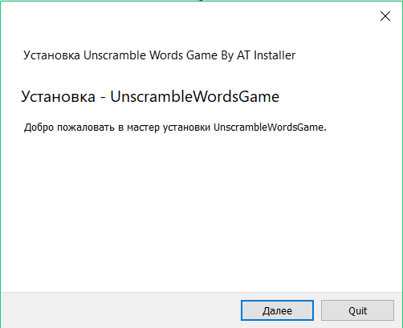
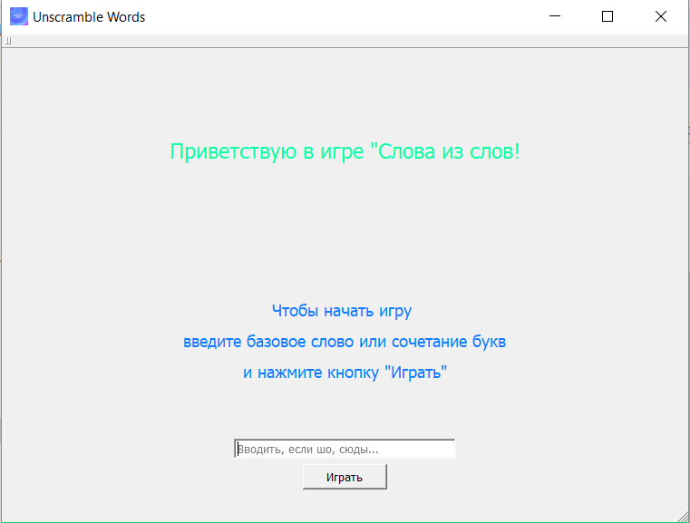
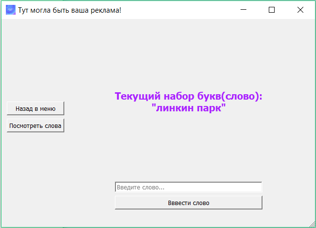
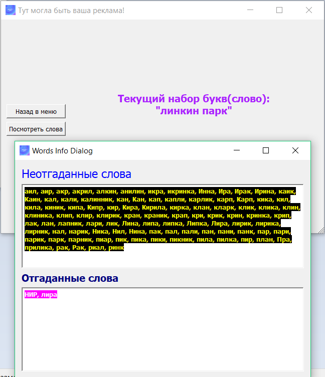
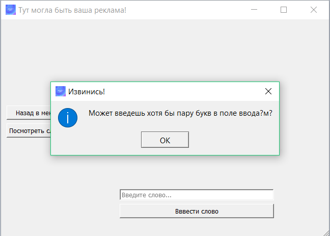
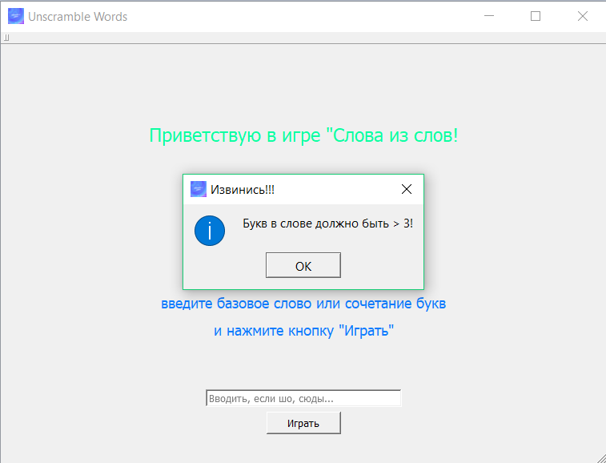
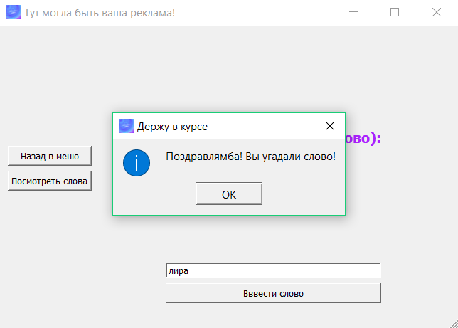
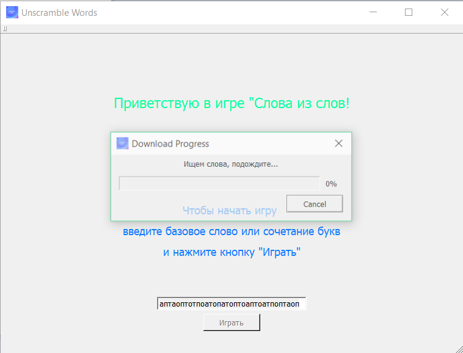

# UnscrambleWordsGame
My replica of "Слова из слов" game. I really do not know how this game is called in English, so let it be "Unscramble Words"

# Intro
This is my last project on OOP on C++ in the 2nd sem. I've received 10 on it.
So, thats a game, where you need to quess all the words made up by computer from the current entered set of letters or words.
It fully created on C++, Qt. 
This game consists of 2 main parts: GUI and query to the hacked API of this site (https://bodyonov.ru/projects/words-game).
This site, in turn, makes a request to the Russian Wiktionary’s database on this site(https://ru.wiktionary.org) and aggregates the results of found words into XML file, and we, in turn, parse this file and provide this words set to user to play the game. Huh, sounds little bit complicated, but it's not so:)
To ease the game, i've designed it only for the Russian user segment. If you want to translate or exted the functionality of this game, your commits will be gladly received:)

# Contents
UnscrambleWordsGame --> main project folder, includes source codes.
UnscrambleWordsGame-Desktop_MSVC2017_64bit-Release --> release project folder, includes all needed .dll and .exe files.
UnscrambleWordsInstallerPackage --> installer folder, includes Qt installer and it's source scripts.

# How to play
Game is so easy to play:
## First of all install in on your computer or just run UnscrambleWordsGame.exe.

## Enter some letters or word into field on main screen and then push "Играть". See it on -->

## After that you can start to guess words or push "Назад в меню" to back into menu and make a new set of letters/words or lso you can push "Посмотреть слова" to wats quessed and unquessed words.

## And that's all. Easy... So, if during the game you'll have any difficulties, these windows will help you to find out the problem -->

